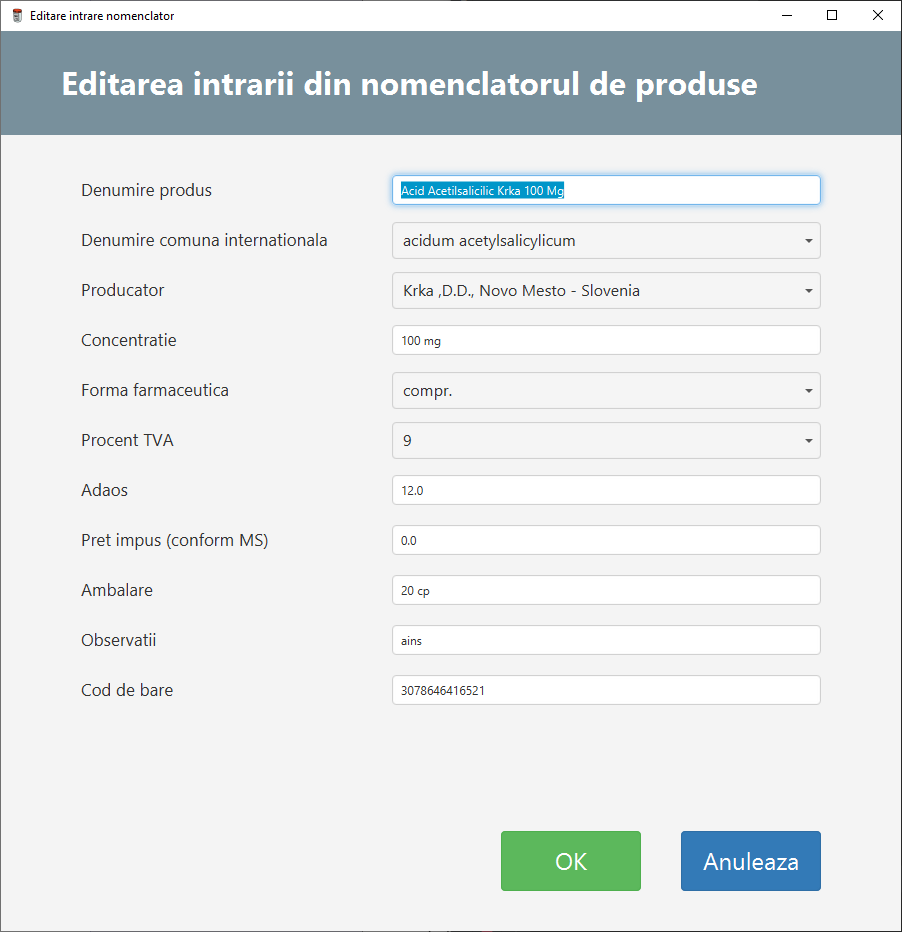

## FARMA 10

Application used for pharmaceutical products storage management (including receiving and selling products).  

Technologies:  
    - Java with JavaFX for interface  
    - Oracle Database 11g for persistence
    
- Application has autentification with administrator account for User management. Passwords are stored in the database as encrypted BLOB.
- logging in external text file
- IN - OUT invoice management implementing all necessary operations in a normal working environment with persistence in the database
- validations
- different lists managing items specific to the pharmaceutical domain. All item operations are detailed in the graphical interface
- invoice export in pdf using itextpdf library for Java
- list reports for invoices including graphical and pdf exports

**Screenshots:**

